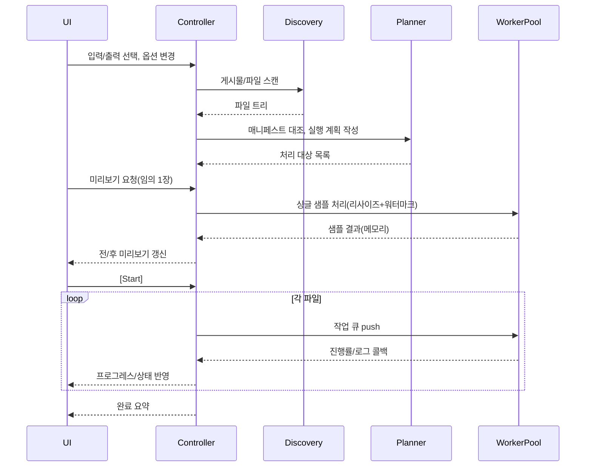

# Simple Watermark & Resize GUI — 설계 초안 v0.1

## 1) 목표/요구사항
- **단위**: 게시물(폴더) 단위. 예) `…/대학생 때 친구랑 엄청 낡은 집에 살았는데/1.jpg, 2.jpg …`
- **작업**: 일괄 워터마킹 + 리사이징(여러 규격 동시 지원: 1080×1080, 1080×1350, 1080×1920 등).
- **원본 무손상**: 원본 훼손 금지. 출력 전용 폴더에 결과 저장.
- **노크롭 기본**: 기본 리사이즈는 **잘림 없이(Contain)**. 필요 시 크롭 모드( Cover )도 선택 가능.
- **GUI**: 간단한 미리보기(전/후), 진행률, 일시정지/중단, 로그.
- **안전성**: 재시작/재실행 시 **중복 처리 방지(멱등성)**, 실패 지점부터 이어서 실행.

---

## 2) 입출력 규칙 & 파일 구조
- **입력 루트**: 사용자가 선택한 폴더의 **1-depth 하위 폴더 = 게시물**로 간주.
- **허용 파일**: `.jpg/.jpeg/.png/.webp`(확장). 파일명에 숫자 우선 정렬(예: `1.jpg, 2.jpg, …`).
- **출력 루트**: `export/`(기본).
  - 경로 규칙: `export/{게시물}/{사이즈명}/{번호}_wm.jpg`
  - 예: `export/대학생 때 친구…/1080x1350/1_wm.jpg`
- **매니페스트(작업 기록)**: `export/.manifest.json`
  - 입력 파일 해시/mtime, 출력 규격/옵션, 성공/실패 로그 보관
- **덮어쓰기 규칙**: 동일 옵션/버전+입력 변경 없음 → **스킵**

---

## 3) 리사이징 전략(모드)
- **Contain(기본)**: 원본 비율 유지, **잘림 없음**, 여백 패딩.
  - 배경: 단색(검정/흰색/사용자 지정) 또는 **블러 배경**(원본 축소 뒤 복제·블러·확대).
- **Cover**: 출력 캔버스 꽉 채움, **잘림 허용**(센터 크롭). 썸네일/카드용.
- **Fit-ShortSide**: 짧은 변만 타겟에 맞추고 긴 변은 비례 축소(긴 쪽 잘림/패딩 없음).
- 샘플링: `Lanczos`(고품질). EXIF Orientation 보정. 색상 공간/ICC는 sRGB 표준화(선택).

> *Contain 수식*: `scale = min(Wt/Ws, Ht/Hs)`, `newW = Ws*scale`, `newH = Hs*scale`; 중심 배치 후 패딩.

---

## 4) 워터마크 옵션
- **종류**: 텍스트 / 이미지(로고).
- **위치**: 9-그리드 앵커(좌상/상/우상/좌/중앙/우/좌하/하/우하) + **여백(padding)**.
- **크기 규칙**: 타겟 짧은 변 대비 **상대 비율(%)** 지정(해상도 독립적).
- **불투명도**: 0~100%.
- **스타일(텍스트)**: 폰트 선택, 크기/행간, 굵기, 스트로크/그림자(밝기 자동 대비).
- **타일링**: 옵션(대각선 반복).
- **회전**: -45° ~ +45°.
- **세이프존**: 중앙 주요 피사체 감지(간단: 중심 영역 밝기/엣지 비율) 시 앵커 교환(선택).

---

## 5) 파이프라인(배치 처리)
1. **발견(Discovery)**: 입력 루트 스캔 → 게시물 목록 구성 → 숫자 정렬.
2. **플랜(Plan)**: 출력 경로/옵션으로 처리 계획 생성, 매니페스트와 대조해 스킵/대상 확정.
3. **미리보기(Preview)**: 선택한 1개 이미지에 리사이즈/워터마크 미리 적용(전/후 비교 슬라이더).
4. **실행(Execute)**: 워커 스레드에서 파일 단위 처리(진행률, 속도 추정).
5. **기록(Record)**: 매니페스트 업데이트, 요약 리포트 표시.

### 간단 시퀀스(미리보기→실행)


---

## 6) 멱등성/재실행
- **키**: `입력경로+파일 mtime/hash + 리사이즈 규격 + 워터마크 옵션 + 앱버전`
- 매니페스트에 저장. 재실행 시 키 비교 → 동일하면 **스킵**.
- **일시정지/중단/재시작**: 큐 정지 → 안전 종료 → 재개 시 미완료만 처리.

---

## 7) 동시성/성능
- **ThreadPoolExecutor**(CPU 코어-1 수준, 사용자 설정).
- 디스크 I/O 병렬화, JPEG/WebP 인코딩 병렬.
- UI 업데이트는 **메인 스레드 after()**에 큐로 전달.
- 대용량 이미지(>8K) 대비 스트리밍 디코드/타일 처리(옵션).

---

## 8) 오류 처리/로그
- 파일 불가/손상/미지원 → 스킵 + 사유 기록.
- 폰트/로고 누락 → 기본값 대체, 경고.
- 경로/권한/한글 경로 문제 → 파이썬 `pathlib` 사용, UTF-8 보장.
- 요약 리포트: 처리 수, 스킵 수, 실패 목록, 평균 처리시간, 총 소요.

---

## 9) GUI 레이아웃(와이어프레임)
```
┌──────────────────────────────────────────────────────────────────────────────────────────────────┐
│  입력 루트 [ … ]   출력 루트 [ … ]    [사이즈] 1080x1080 ☐ 1080x1350 ☑ 1080x1920 ☐               │
│  리사이즈 모드: (● Contain  ○ Cover  ○ Fit-ShortSide)  배경: [흰]  블러패딩 ☐                      │
│  워터마크:  [텍스트/로고]  위치: [우하]  크기(%): [ 5 ]  불투명도: [ 30 ]  타일 ☐                   │
├─────────────── 게시물 리스트 ───────────────┬────────────── 미리보기(전/후 슬라이더) ───────────────┤
│  ▸ 대학생 때 친구랑…   0/12 (대기)                 │   [원본] |——슬라이더——| [결과]                 │
│  ▸ 졸업식 사진          8/20 (진행 40%)            │                                              │
│  ▸ 여행_부산_2023       완료                      │   [이전] [다음]  확대 100%  격자 보기 ☐        │
├──────────────────────────────────────────┴───────────────────────────────────────────────────────┤
│  [Start] [Pause] [Stop]   전체 진행: ▮▮▮▯▯  42%   ETA 03:12   스레드: 3                       │
│  로그: … 처리완료, 스킵: …, 실패: … (더보기)                                                       │
└──────────────────────────────────────────────────────────────────────────────────────────────────┘
```

---

## 10) 데이터 모델(개략)
- **Post**: `{name, path, items:[Item…], status, progress}`
- **Item**: `{src_path, index, exif, targets:[Target…], result}`
- **Target**: `{size:(W,H), mode, bg, wm, out_path}`
- **Watermark**: `{type:text|image, anchor, scale_pct, opacity, style, tile, rotate}`
- **Settings**: UI 상태 직렬화(프로필로 저장/불러오기 가능)

---

## 11) 모듈/패키지 레이아웃(초안)
```
project_root/
  app.py                 # Tk 앱 엔트리
  controller.py          # 상태/이벤트, 파이프라인 오케스트레이션
  settings.py            # 설정 로드/저장(ini/json)
  services/
    discovery.py         # 폴더 스캔, 정렬
    planner.py           # 매니페스트 대조, 실행 계획
    image_ops.py         # 공통: 로드/EXIF/ICC/샘플링
    resize.py            # Contain/Cover/Fit 구현
    watermark.py         # 텍스트/로고 렌더, 타일/회전/대비
    writer.py            # 포맷별 저장(JPEG/WebP), 메타
  ui/
    main_window.py       # 프레임 배치, 메뉴/툴바
    preview_pane.py      # 전/후 비교, 슬라이더, 확대
    post_list.py         # 게시물/파일 트리 + 진행률
    options_panel.py     # 사이즈/모드/워터마크 옵션
    status_bar.py        # 진행/ETA/스레드 수
  workers/
    job_runner.py        # ThreadPool, 큐, 취소/일시정지
  data/
    fonts/               # 기본 폰트(라이선스 주의)
  export/
    .manifest.json       # 작업 기록
```

---

## 12) 엣지 케이스
- 파일명이 숫자가 아닐 때: 사전식→숫자 추출 후 보조 정렬.
- 고해상도 초대형(메모리): 임계값 초과 시 다운샘플링 단계적 처리.
- 투명 PNG: 배경 합성 규칙 적용.
- 색 반전/밝기 편차 큰 사진: 워터마크 가독성 위해 자동 스트로크 or 그림자.
- 한글/공백/긴 경로: Windows 경로 길이 방지(상대경로, 짧은 이름 옵션).

